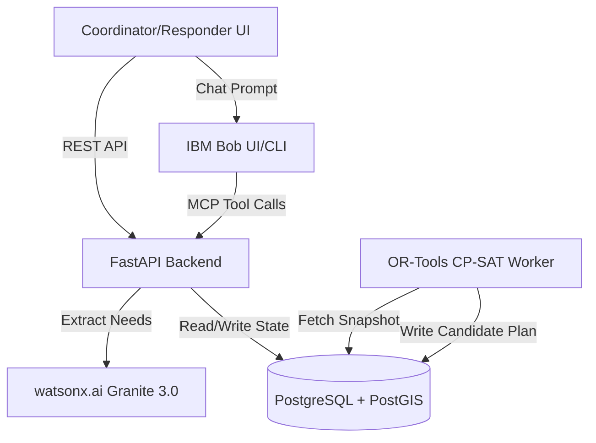

# Architecture

## System Diagram

## Component Table

| Component | Technology | Responsibility |
|---|---|---|
| **Frontend** | React, TypeScript, Vite | Provide coordinator dashboard, map views, and field reporter forms. |
| **API Backend** | FastAPI, Python | Route handling, data validation (Pydantic), transaction boundaries. |
| **Database** | PostgreSQL, PostGIS, SQLAlchemy | Immutable ledger for assignments, geographical zone storage, atomic locks. |
| **Optimization Engine** | Google OR-Tools | Generate CP-SAT based resource allocation plans under 5-second limits. |
| **Intelligence Extraction** | IBM watsonx.ai | Parse unstructured text into structured Needs (JSON). |
| **Conversational Agent** | IBM Bob (MCP) | Allow coordinators to query incident state and execute approvals conversationally. |

## Data Flow (End-to-End)

1. A Responder submits an unstructured text report via the React UI.
2. The FastAPI backend sends the raw text to **watsonx.ai**, which returns a structured JSON `Need` object.
3. The `Need` is saved to PostgreSQL, linked to a specific `Zone`.
4. The Coordinator triggers a planning run. The **OR-Tools** worker reads a snapshot of all unassigned Needs and available Resources.
5. OR-Tools generates an optimal `Plan` and saves it as a candidate.
6. The Coordinator (via UI or **IBM Bob**) reviews the candidate plan and executes an atomic approval, locking the resources in the database and creating `Assignments`.

## Security & Scalability

- **Security:** Approvals use explicit PostgreSQL row-level locks (`SELECT FOR UPDATE`) to prevent race conditions and double-booking.
- **Scalability:** The planning engine is designed to run asynchronously in a separate worker process so that intensive mathematical optimizations do not block the main REST API event loop.
